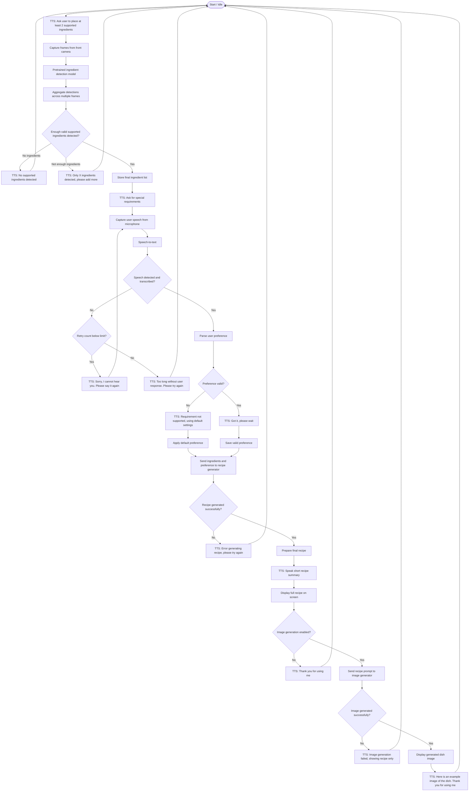

```mermaid
flowchart TD
    A([Start / Idle]) --> B[TTS: Ask user to place at least 2 supported ingredients]
    B --> C[Capture frames from front camera]
    C --> D[Pretrained ingredient detection model]
    D --> E[Aggregate detections across multiple frames]
    E --> F{Enough valid supported ingredients detected?}

    F -- No ingredients --> G[TTS: No supported ingredients detected]
    G --> A

    F -- Not enough ingredients --> H[TTS: Only X ingredients detected, please add more]
    H --> A

    F -- Yes --> I[Store final ingredient list]
    I --> J[TTS: Ask for special requirements]
    J --> K[Capture user speech from microphone]
    K --> L[Speech-to-text]
    L --> M{Speech detected and transcribed?}

    M -- No --> N{Retry count below limit?}
    N -- Yes --> O[TTS: Sorry, I cannot hear you. Please say it again]
    O --> K
    N -- No --> P[TTS: Too long without user response. Please try again]
    P --> A

    M -- Yes --> Q[Parse user preference]
    Q --> R{Preference valid?}

    R -- No --> S[TTS: Requirement not supported, using default settings]
    S --> T[Apply default preference]

    R -- Yes --> U[TTS: Got it, please wait]
    U --> V[Save valid preference]

    T --> W[Send ingredients and preference to recipe generator]
    V --> W
    W --> X{Recipe generated successfully?}

    X -- No --> Y[TTS: Error generating recipe, please try again]
    Y --> A

    X -- Yes --> Z[Prepare final recipe]
    Z --> AA[TTS: Speak short recipe summary]
    AA --> AB[Display full recipe on screen]

    AB --> AC{Image generation enabled?}
    AC -- No --> AD[TTS: Thank you for using me]
    AD --> A

    AC -- Yes --> AE[Send recipe prompt to image generator]
    AE --> AF{Image generated successfully?}

    AF -- No --> AG[TTS: Image generation failed, showing recipe only]
    AG --> A

    AF -- Yes --> AH[Display generated dish image]
    AH --> AI[TTS: Here is an example image of the dish. Thank you for using me]
    AI --> A
```
